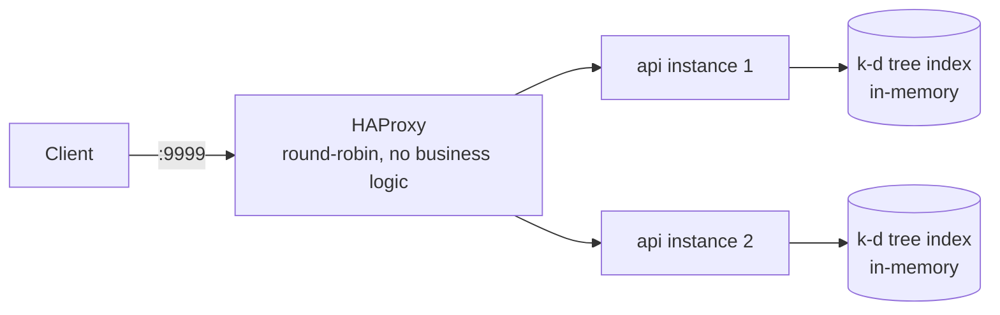

# Rinha de Backend 2026 — Fraud Detector (Go)

Fraud-detection backend for the
[Rinha de Backend 2026](https://github.com/zanfranceschi/rinha-de-backend-2026)
challenge: vectorize a transaction into 14 normalized dimensions, find its
5 nearest neighbors in a labeled reference set, and approve or deny it
based on the vote.

The edition is closed (submissions ended 2026-06-05). This repo is a
polished portfolio solution, built to balance performance with a
production-shaped codebase — not to squeeze out every last nanosecond.



## Quickstart

```sh
make docker-up
curl -X POST localhost:9999/fraud-score -d @resources/example-payloads.json
make docker-down
```

## Docs

- [**How the application works, end to end**](docs/APPLICATION_FLOW.md) —
  the full journey from the raw reference file to a `fraud-score` response,
  with diagrams, written for readers with zero vector-search background.
- [**Architecture & infra decisions**](docs/INFRASTRUCTURE.md) —
  topology, resource budget, the Dockerfile explained, and why this isn't a
  bit-mining exercise.
- [**How to run**](docs/HOW_TO_RUN.md) — local dev, Docker, tests,
  load testing, configuration.
- [**Running from the published image only**](docs/RUNNING_FROM_GHCR.md) —
  no clone, no build, same shape as the challenge's own `submission` branch.
- [**Results**](docs/RESULTS.md) — correctness, test coverage, and
  measured performance (including a real infra bug found and fixed through
  load testing).
- [**Path to a 6000-point score**](docs/PATH_TO_EXCELLENCE.md) — what it
  would actually take to close the gap to the scoring ceiling, itemized:
  what each technique means, what it costs, and why this project stops
  short of it.
- [**Project structure**](docs/PROJECT_STRUCTURE.md) — what every
  top-level folder is for.

## License

[MIT](../LICENSE) — required for participation in the Rinha de Backend.
