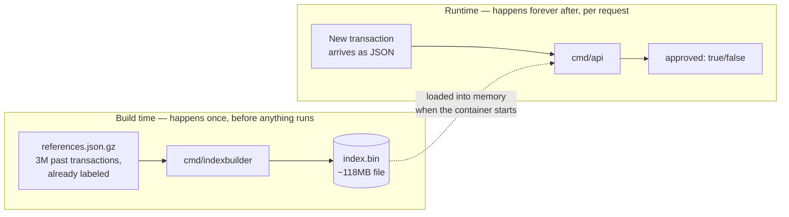
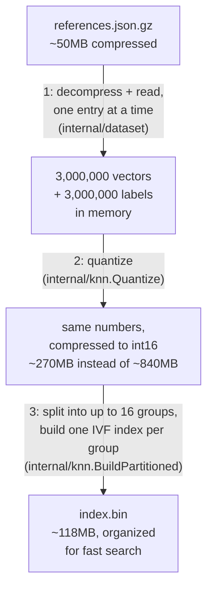
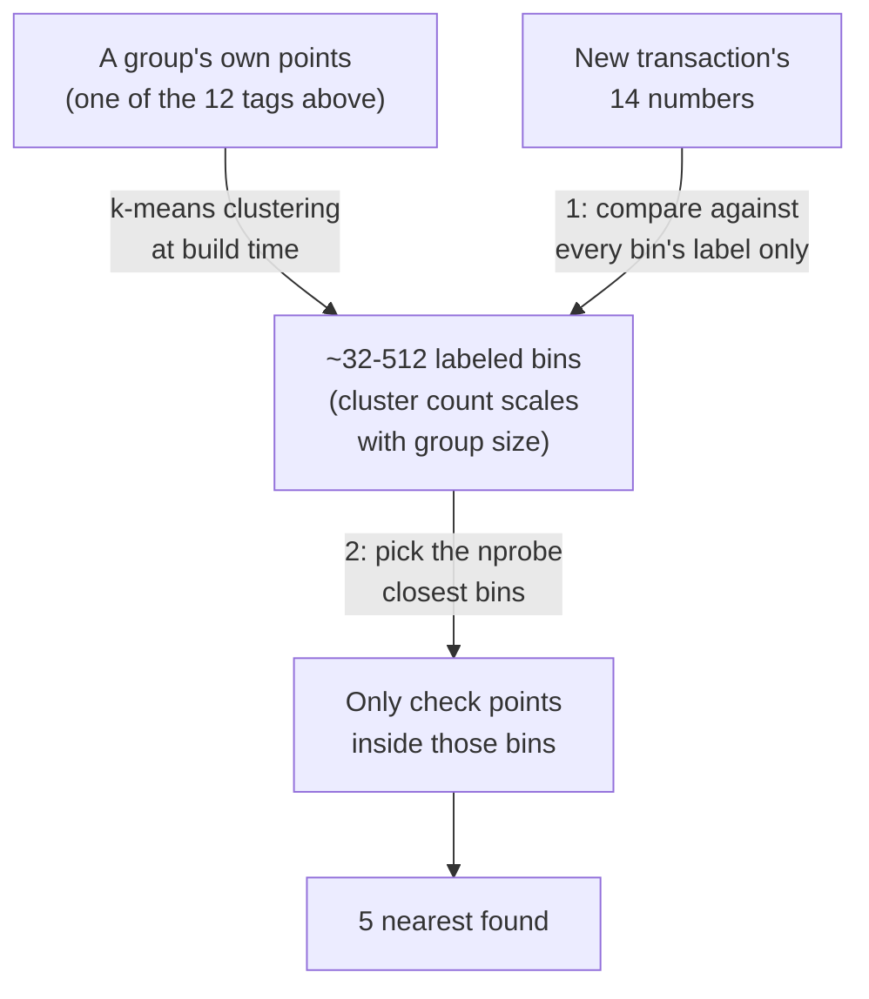
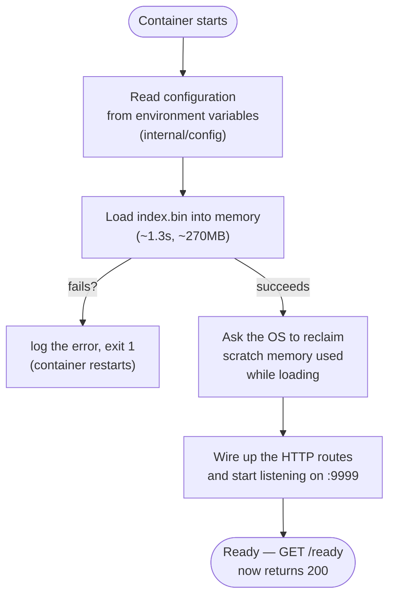
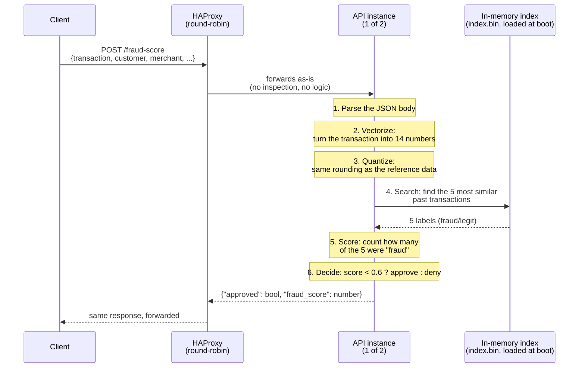
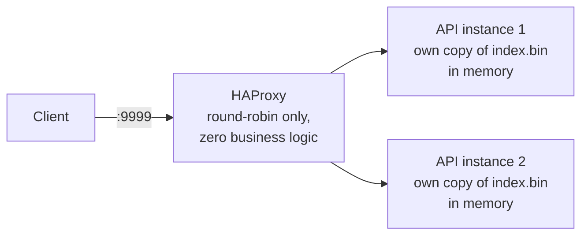

# How the application works, end to end

This walks through **everything** that happens — from a raw file of past
transactions to a single `approved: true/false` answer — assuming no prior
knowledge of vector search, clustering, or any of that. If you can read a
flowchart, you can follow this.

## The short version

This app answers one question: *"is this new transaction shaped like past
fraud, or like a normal purchase?"* It answers it by comparing the new
transaction against a huge pile of **already-labeled** past transactions,
and copying whatever the 5 most similar ones were labeled. No AI model, no
training — just very fast comparison-by-similarity. That single idea is the
entire product; everything below is just the plumbing to make that
comparison happen accurately and in under a millisecond.

## The two lives of this application

Everything below splits cleanly into two phases that never overlap:



**Build time** turns a big file of history into a data structure optimized
for one operation: "find the 5 entries most similar to this one, fast."
**Runtime** is the actual web server, answering requests using that
structure. Build time happens inside `docker build`, once; runtime happens
inside the running container, millions of times.

---

## Part 1 — Build time: from a spreadsheet of history to a fast lookup table

### The raw material

[`resources/references.json.gz`](../../resources/references.json.gz) is a
compressed file with 3,000,000 entries that looks like this:

```json
{ "vector": [0.01, 0.0833, 0.05, ..., 0.0416], "label": "legit" }
{ "vector": [0.58, 0.92, 1.0, ..., 0.0032], "label": "fraud" }
```

Think of it as a **ledger of already-solved cases**: 3 million past
transactions, each one already boiled down to 14 numbers (more on that
below) and already stamped "this one was fraud" or "this one was legit."
Nobody needs to figure out those labels — they came pre-labeled from the
challenge organizers, based on real (synthetic) outcomes. This app never
invents or re-labels anything; it only ever *compares against* this fixed
ledger.

### The build pipeline

[`cmd/indexbuilder`](../../cmd/indexbuilder/main.go) runs exactly once, at
Docker build time (see [`INFRASTRUCTURE.md`](INFRASTRUCTURE.md) for why),
and does three things to that ledger:



**Step 1 — read.** Each of the 3M lines is parsed one at a time (never all
loaded as raw JSON text at once — that would need way more memory than this
challenge's 350MB budget allows). Every entry becomes 14 floating-point
numbers plus a fraud/legit flag.

**Step 2 — quantize** (a fancy word for "round to less precision, on
purpose"). Each of those 14 numbers lives between -1 and 1. Storing them as
full 64-bit decimals is more precision than this problem needs, so each one
gets rescaled and rounded into a 16-bit whole number instead (multiply by
10,000, round). This alone shrinks the dataset from ~840MB to ~270MB — the
kind of thing that matters a lot when the entire app, including the load
balancer, has to fit in 350MB total.

**Step 3 — organize for search.** This is the important one, explained
below with a real analogy, because it's the one non-obvious idea in the
whole app.

### Why not just compare against all 3 million, every time?

That's the naive approach — and it works! For each new transaction, compute
the distance to all 3,000,000 stored ones, sort, take the 5 closest. It's
also too slow: measured on this exact dataset, that "check everyone"
approach takes tens of milliseconds *per request* — and the scoring rules
for this challenge want answers in around 1 millisecond. Something faster
was needed, and it turned out to take two tricks stacked together, not one.

**Trick 1 — split by a coarse tag first.** 4 of the 14 numbers are already
yes/no answers (was the terminal online? was the card physically present?
is this an unfamiliar merchant? did this customer have a previous
transaction at all?). Combine those 4 yes/no answers and there are only 16
possible combinations — think of it like a library that first splits every
book by language before shelving within each language section: a French
lookup never has to check the English section at all. Every one of the 3
million reference transactions gets sorted into one of up to 16 groups
this way (the real dataset produces 12 non-empty ones) before anything
else happens, and a new transaction's own 4 yes/no answers pick which
single group it will ever be compared against. This is a real, measured
improvement, not just theory — see
[`RESULTS.md`](RESULTS.md#categorical-tag-partitioning) for exactly how
much it helped and one surprise it caused (some groups turned out to hold
far more transactions than others).

**Trick 2 — inside each group, cluster first, then only check the nearby
clusters.** This is called an **IVF index** (Inverted File — the name is a
historical accident from library science, not a useful mental image).
Picture a librarian who, instead of shelving books strictly alphabetically,
first sorts every book in their section into one of a few hundred labeled
bins by topic (grouped by *similarity*, discovered by an algorithm called
k-means — bins aren't picked by hand, they emerge from the data). A reader
looking for "something like this book" doesn't check every bin — they walk
straight to the handful of bins whose *label* is closest to what they want,
and only look inside those.



Concretely: at build time, `internal/knn.BuildIVF` runs k-means on a
group's own vectors to produce a set of "bin labels" (centroids). At
request time, the new transaction's 14 numbers are compared against every
*label* first (cheap — there are only dozens to hundreds of them, not
millions), the `nprobe` closest bins are picked, and only the real
transactions inside those specific bins get compared in full. `KNN_NPROBE`
(default `8`) controls how many bins get checked — check too few and real
near-matches in an unchecked bin get missed; check too many and there's no
speed benefit left over comparing everyone. See
[`RESULTS.md`](RESULTS.md#replacing-the-k-d-tree-with-ivf) for the actual
measured numbers behind that trade, including two other ideas that were
tried first, looked good on paper, and made things worse in real testing
before this one was tried and won decisively.

The output of all these steps is a single file, `index.bin`, containing
the whole organized structure — all 12 group-trees together. That file
gets baked directly into the Docker image (see
[`INFRASTRUCTURE.md`](INFRASTRUCTURE.md)) — the running application never
touches `references.json.gz` at all.

---

## Part 2 — Starting the application

When a container starts, [`cmd/api`](../../cmd/api/main.go) runs through a
short, strict startup sequence before it will accept a single request:



This matters for one reason worth spelling out: **the 3-million-entry index
is loaded exactly once, when the container boots**, and then lives in RAM
for as long as the container runs. A request never triggers any file
reading or parsing — it only ever reads a structure that was already
sitting ready in memory. That's *why* answering a request can be this fast:
the expensive work already happened, once, well before the first customer's
transaction ever arrived.

---

## Part 3 — A request's full journey

The application exposes exactly two HTTP routes, both on port `9999`:

| Route | Purpose |
|---|---|
| `GET /ready` | "Are you alive and ready for traffic?" — used by HAProxy and by whoever is orchestrating containers. |
| `POST /fraud-score` | The actual product: "is this transaction fraud?" |

### `GET /ready` — the simple one

By the time the HTTP server is even listening, the index has already
loaded successfully (see Part 2) — so this route has nothing left to check.
It just answers `200 OK` immediately. No body, no logic.

### `POST /fraud-score` — the real one, step by step

Here is one transaction's complete trip through the system, from the
moment a client sends it to the moment it gets an answer:



Each numbered step, in detail:

#### Step 1 — Parse

The request body is JSON describing one transaction — amount, time, the
cardholder's spending history, the merchant, the terminal, and (maybe) the
previous transaction. If it doesn't parse as valid JSON, the app answers
`400 Bad Request` immediately and none of the steps below happen.

#### Step 2 — Vectorize: turning a transaction into 14 numbers

This is the step that actually needs explaining, because "vector" sounds
scarier than what it is: it's just **the same transaction, described as a
list of 14 numbers instead of a paragraph**, each one scaled to fit between
0 and 1 (so that "amount" and "hour of day" and "distance in km" — wildly
different units — become directly comparable). This happens in
[`internal/vectorize`](../../internal/vectorize/vectorize.go), following a
fixed formula for each position:

| # | What it captures, in plain words | How it's phrased as a 0–1 number |
|---|---|---|
| 0 | How large is this purchase? | amount ÷ R$10,000 (capped at 1.0) |
| 1 | How many installments? | installments ÷ 12 |
| 2 | Is this unusually large *for this specific customer*? | (amount ÷ their usual average) ÷ 10 |
| 3 | What time of day? | hour ÷ 23 (midnight=0, 11pm≈1) |
| 4 | What day of the week? | Monday=0 ... Sunday=1 |
| 5 | How long since this customer's last purchase? | minutes ÷ 1 day — or **-1** if there's no previous purchase on record at all |
| 6 | How far is this from their *last* purchase? | km ÷ 1,000 — or **-1** if there's no previous purchase |
| 7 | How far is this from the cardholder's home address? | km ÷ 1,000 |
| 8 | How active has this customer been in the last 24h? | transaction count ÷ 20 |
| 9 | Was this an online purchase? | 1 if yes, 0 if in-person |
| 10 | Was the physical card actually there? | 1 if yes, 0 if not |
| 11 | Has this customer ever shopped at this merchant before? | 1 if it's a **new/unknown** merchant, 0 if familiar |
| 12 | How risky is this *type* of store, historically? | a fixed table by store category (e.g. gambling-adjacent categories score high, groceries score low; unlisted categories default to 0.5) |
| 13 | How big is this merchant's typical sale? | merchant's average ticket ÷ R$10,000 |

Two details worth calling out because they trip people up:

- **The `-1` values (dimensions 5 and 6) are deliberate, not an error.**
  When a customer has no purchase history at all, there is nothing to
  measure "minutes since" or "km from" against. Rather than guessing a
  number, the app writes `-1` — a value that can never occur naturally
  (every real measurement lands between 0 and 1) — so that "no history"
  cases end up clustered together with other "no history" cases when the
  search runs, instead of being confused with some *specific* small
  distance or short time gap.
- **Every number is capped between 0 and 1** ("clamped," in the code). A
  R$50,000 purchase doesn't get a score of 5.0 — it gets capped at 1.0,
  same as a R$10,000 one. Past a certain point, "how far over the line"
  stops mattering; only "over the line or not" does.

The result of this step is one list of 14 numbers — the exact same shape as
every entry in the 3-million-row reference file from Part 1.

#### Step 3 — Quantize

The freshly computed 14 numbers get rounded into the same compact int16
format the reference data was stored in (Part 1, step 2). This isn't
optional — the search in the next step is comparing numbers directly, so
both sides need to speak the same "precision dialect."

#### Step 4 — Search: find the 5 most similar past cases

This is where the group indexes from Part 1 actually get used. The app
looks at this transaction's own 4 yes/no answers (online? card present?
unknown merchant? has a previous transaction?) to pick which of the up to
16 groups to search — the same rule used to build the groups in the first
place — then hands that one group's IVF index the new transaction's 14
numbers and asks: *"of the entries you hold, which 5 are numerically
closest to this one?"* "Closest" here means
literal straight-line distance across all 14 numbers at once (the same
math as distance on a map, just extended from 2 coordinates to 14). The
search returns those 5 entries — specifically, their fraud/legit labels;
the actual historical transaction details are never even loaded, only the
label.

**Why 5, and why those exact 5?** Because the pattern "things that look
alike tend to behave alike" is the entire premise. If 4 of the 5 most
similar past transactions the system has ever seen were fraud, that's a
strong signal this one probably is too — not because of any rule anyone
wrote down, but because fraud tends to have a recognizable "shape" (unusual
amount, odd hour, unfamiliar merchant, no purchase history, far from home
— several of those at once), and this comparison surfaces that shape
automatically.

#### Step 5 — Score

Count how many of those 5 labels say `"fraud"`. Divide by 5. That's the
`fraud_score` — always one of `0.0, 0.2, 0.4, 0.6, 0.8, 1.0`, nothing else
is possible with 5 neighbors.

#### Step 6 — Decide

`approved = fraud_score < 0.6`. This threshold is fixed by the challenge
rules, not configurable: 3 or more "fraud" votes out of 5 denies the
transaction; 2 or fewer approves it. ([`internal/scoring`](../../internal/scoring/scoring.go)
is the entire implementation of this step — it's intentionally that small.)

#### The response

```json
{ "approved": false, "fraud_score": 0.6 }
```

Sent back exactly as-is through HAProxy to the original client. The whole
round trip, in the numbers actually measured for this project, lands well
under a millisecond in the common case — see
[`RESULTS.md`](RESULTS.md).

---

## Putting it all together, with the real topology

The diagrams above showed one API instance for clarity. The real deployment
always runs two, behind a load balancer that only ever does plain
round-robin — see [`INFRASTRUCTURE.md`](INFRASTRUCTURE.md) for why that
split exists and what each piece is allowed (and not allowed) to do:



Both instances are byte-for-byte identical processes, each with its own
independent copy of the 270MB index loaded into its own memory — there is no
shared database and no cross-instance coordination of any kind. This is
deliberate: since the reference data never changes during a run (Part 1
happens once, at build time), there's nothing to keep in sync. Either
instance can answer any request, entirely on its own.

---

## Glossary, for the truly unfamiliar

- **Vector** — a fixed-length list of numbers describing something. Here,
  14 numbers describe one transaction. Two vectors are "similar" if their
  numbers are close to each other, position by position.
- **Nearest neighbor** — given a new vector, the stored vector(s) closest
  to it. "5 nearest neighbors" = the 5 closest matches.
- **IVF index (Inverted File)** — a way of pre-organizing a big pile of
  vectors, by first clustering them (see the "librarian sorting into
  labeled bins" analogy above), so that finding nearest neighbors only
  requires checking the bins nearest the query instead of every vector.
- **k-means** — the clustering algorithm IVF uses to decide what the bins
  are, by grouping similar vectors together automatically.
- **Quantize** — rounding numbers to a less precise, more compact format on
  purpose, to save memory, when that precision isn't actually needed.
- **Label** — the known, correct answer attached to a historical record
  ("fraud" or "legit"), used only for comparison, never re-derived.
