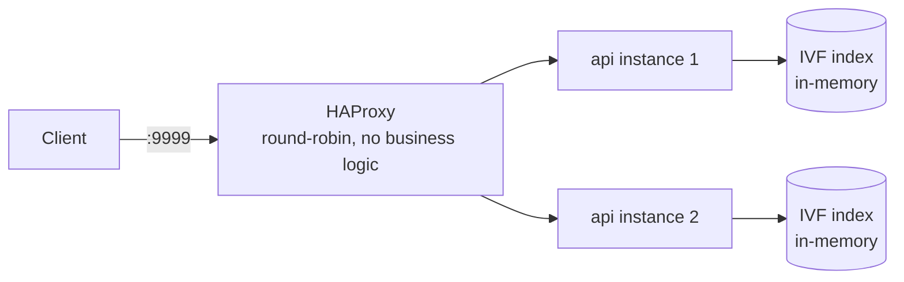

# Architecture & infra decisions

What this is built out of, and why — including the trade-off the whole
project is built around.

## Design philosophy

This challenge is scored on raw latency and detection accuracy, which
rewards squeezing out every possible nanosecond — hand-rolled event loops,
kernel-bypass networking, SIMD assembly, no garbage collector, no logging.
That's a legitimate way to chase the top of a latency-scored leaderboard.
It's also not how most production Go services get built, and it trades
away exactly the things a team maintaining this code for years would want:
readable request handlers, structured logs, a standard project layout, and
a test suite.

This repo deliberately makes the opposite trade:

| | maximum-score approach | this repo |
|---|---|---|
| networking | custom event loop, kernel bypass | `net/http`, HAProxy (plain round-robin) |
| NN search | hand-tuned, SIMD/assembly | categorical partitioning + IVF, pure Go |
| observability | none (every byte of overhead removed) | structured JSON logs (`log/slog`), request IDs |
| project shape | single binary, hand-rolled formats | `cmd/` + `internal/`, table-driven tests, CI, lint |

Measured results of that trade — what it costs, what it doesn't — are in
[`RESULTS.md`](RESULTS.md), including [`PATH_TO_EXCELLENCE.md`](PATH_TO_EXCELLENCE.md)'s
honest accounting of exactly what closing the remaining gap would require.

## Topology

- **Load balancer**: HAProxy, plain round-robin over `/ready` health checks.
  Per [`docs/en/ARCHITECTURE.md`](https://github.com/zanfranceschi/rinha-de-backend-2026/blob/main/docs/en/ARCHITECTURE.md),
  it never inspects request payloads (see `deployments/haproxy.cfg`).
- **API**: Go 1.27, stdlib `net/http` (Go 1.22+'s method-aware
  `http.ServeMux` is enough for two routes — no router framework).
- **Reference index**: pre-processed into an IVF index binary
  (`cmd/indexbuilder`) at Docker **build** time — never at request time or
  even at container start beyond a single deserialize. See
  [`docs/en/DATASET.md`](https://github.com/zanfranceschi/rinha-de-backend-2026/blob/main/docs/en/DATASET.md):
  *"the reference files do not change during the test, so they can be
  pre-processed freely."*
- **Resource budget** (aggregate across every container, per the
  challenge's rules): 1 CPU / 350MB. Current split: HAProxy 0.05 CPU/30MB,
  each API replica 0.475 CPU/160MB.

## The k-NN search

The 14-dimension vectorization and the k-NN decision are specified exactly
in the challenge's
[`DETECTION_RULES.md`](https://github.com/zanfranceschi/rinha-de-backend-2026/blob/main/docs/en/DETECTION_RULES.md)
and implemented in `internal/vectorize` and `internal/knn`. Two design
choices work together here:

1. **Categorical-tag partitioning.** Four of the 14 dimensions are already
   boolean-valued or have a sentinel for "absent" (`is_online`,
   `card_present`, `unknown_merchant`, whether `last_transaction` was
   present). `internal/knn.Tag` derives a 4-bit key from these, and
   `internal/knn.PartitionedIndex` builds one search index per non-empty
   tag (12, on the real dataset) instead of a single 3,000,000-vector
   index. A query is routed to just its own partition — the reference set
   never needs comparing against tag combinations it structurally can't
   match.
2. **IVF (Inverted-File) search within each partition.** `internal/knn.BuildIVF`
   clusters a partition's own vectors with k-means (cluster count scaled
   to the partition's size, clamped to `[32, 512]`), and `IVFIndex.Search`
   only scans the `nprobe` clusters nearest the query instead of every
   vector in the partition. This replaced an earlier k-d tree entirely —
   see [`RESULTS.md`](RESULTS.md#replacing-the-k-d-tree-with-ivf) for why:
   in short, a k-d tree loses most of its pruning power at 14 dimensions,
   while IVF's cost is a direct, predictable function of `nprobe` instead
   of an unpredictable amount of tree backtracking. `KNN_NPROBE` controls
   `nprobe` at runtime.

See [`RESULTS.md`](RESULTS.md#categorical-tag-partitioning) for the
partitioning numbers and [`RESULTS.md`](RESULTS.md#replacing-the-k-d-tree-with-ivf)
for the IVF numbers and the `nprobe` tuning that followed — `8` is what
this project ships with today.

`resources/references.json.gz` is the real 3,000,000-vector official
dataset (see [`RESULTS.md`](RESULTS.md#the-dataset-it-really-is-3000000-vectors)
for how the correct file was tracked down — the one published on the
challenge repo's `main` branch is a smaller, checksum-mismatched 1M-vector
file). The code adapts to whatever size is present at build time; nothing
is hardcoded to 3M.

## The Dockerfile

Three stages, each with one job:

1. **`build`** — `golang:1.27-alpine`, compiles `cmd/api` and
   `cmd/indexbuilder` as static binaries (`CGO_ENABLED=0`).
2. **`indexer`** — runs `indexbuilder` against the vendored
   `resources/references.json.gz` (already in the build context from
   `COPY . .` in the previous stage) to produce `index.bin`. No network
   access happens in this stage — the dataset is committed to the repo the
   same way `loadtest/fixtures/test-data.json` is, so `docker build` never
   depends on `raw.githubusercontent.com` being reachable or unchanged.
3. **`final`** — `gcr.io/distroless/static-debian12:nonroot`. Copies only
   the `api` binary and `index.bin` — no Go toolchain, no shell, no package
   manager, runs as a non-root user by default.

A few specific choices:

- **No `ENV PORT=9999` / `ENV INDEX_PATH=...`.** `internal/config`'s own
  default for `PORT` is already `9999`, so setting it again in the image
  would be pure duplication. `INDEX_PATH` defaults to `data/index.bin` (a
  relative path, meant to work for local dev too) — instead of overriding
  it with an absolute path, `index.bin` is copied to `/data/index.bin` and
  `WORKDIR /` is set, so the Go binary's own default resolves correctly
  with zero image-specific configuration. The container runs correctly with
  **no environment variables set at all**; `docker-compose.yml` sets `PORT`
  explicitly anyway, since that one's a deployment fact (the port this
  challenge requires), not a build fact.
- **`EXPOSE 9999` stays**, even though it has no functional effect here
  (`docker-compose.yml`'s `ports:` on HAProxy does the actual publishing,
  and container-to-container traffic on the `rinha` network doesn't need it
  either). It costs one line and documents the listening port for anyone
  who pulls the image directly — see
  [`RUNNING_FROM_GHCR.md`](RUNNING_FROM_GHCR.md).
- **`distroless/static` over `scratch`.** Both would work — the binary is
  fully static. Distroless adds a working non-root user
  (`USER nonroot:nonroot`) out of the box; on `scratch` there's no
  `/etc/passwd` at all, so you'd manage the numeric UID yourself
  (`USER 65532:65532`). Given `index.bin` alone is ~39MB, the base image
  size difference between the two (a few MB) doesn't matter here — the
  non-root user support is the deciding factor.

## Compliance

Only the official `resources/references.json.gz` is ever used to build the
reference index — never `test/test-data.json`, preview payloads, or final
payloads, per the challenge's rules
([`docs/en/DETECTION_RULES.md`](https://github.com/zanfranceschi/rinha-de-backend-2026/blob/main/docs/en/DETECTION_RULES.md):
*"Using the test payloads as a reference or for fraud lookup is not
allowed"*). `loadtest/fixtures/test-data.json` is used exactly as the
challenge intends: as input to the official k6 script to **measure** this
service's own behavior, never to build or influence the detection index.

## CI

`.github/workflows/ci.yml` runs `go vet`, `golangci-lint`, the unit test
suite (`-race -cover`), then builds the real Docker image and runs the
official k6 smoke test against the containerized stack. `release.yml`
publishes the image to GHCR (tagged `latest` and by commit SHA) on every
push to `main` — see the note at its top
about GHCR's default package visibility before assuming a failed `docker
pull` is a bug.
